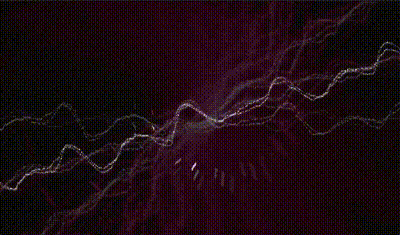
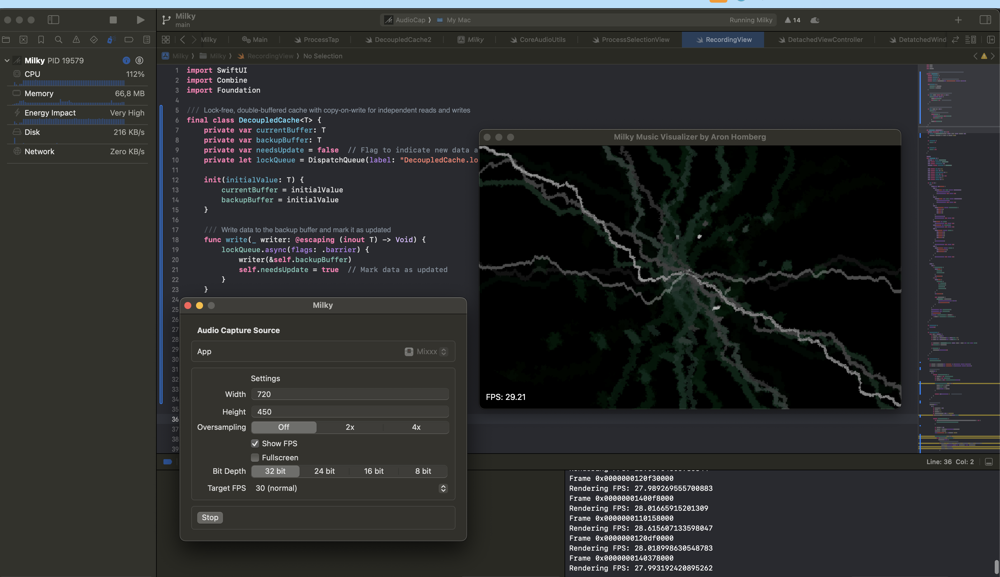

    

      
    

  # MilkyApp

  ### Music Visualizer inspired by Ryan Geiss' work on "Geiss"

  
  
  #### &ndash; IN DEVELOPMENT | PRE-ALPHA &ndash;

  

> 🛠️ MilkyApp makes use of the macOS 14.2+ "Audio Tap" feature to tap into App audio output streams. As a user, you can select any app (e.g.   Spotify), and MilkyApp will render the waveform artistically and anachronistically - inspired by the wonderful work of <a href="https://www.geisswerks.com/geiss/" target="_blank">Ryan Geiss' screensaver/Winamp plugin "Geiss"</a>.

## 🌟 Details

  

  

### 🔬 How does MilkyApp work?

- ✅ **MilkyApp runs on the CPU**: You'll find that the rendering code is written in C (standard C99), uses no graphics libraries whatsover and simply calculates each pixel value of a framebuffer on it's on.
-  ✅ **Waveform rendering**: First a waveform is rendered, that uses the captures the audio stream as a seed for the curve.
-  ✅ **Blending, Rotation, Transformation**: For every next frame, the previous framebuffer is slightly rotated and transformed (zoomed in). Also, the color intensity is blended out by a factor. This makes "older" waveform renderings diminish over time and allows for smooths transitions between frames.
-  ✅ **Colorization**: Pre-calculated (generated) color sets are used to colorize each frame.
-  ✅ **FFT analysis and spectral flux detection**: For every frame, the waveform is transformed into a frequency/volume spectrogram (using a custom vFFT implementation). This allows the program to measure, how loud each frequency is playing at each time. To detect energy spikes in lows and highs, the spectrum is averaged and diffed over time, and a spectral flux is calculated. Whenever the energy drastically differs from previous frames, `SIG_ENERGY` is detected.
- ✅ **Color and movement change automation**: Currently, all 30 secs, color changes may occur, when `SIG_ENEGRY` is detected. Also, rotation targets are randomly assigned so that the "flight" into the center of your monitor, feels artificially controlled.
- ✅ **Effects**: Currently, two "chasers" are rendered with each frame. Their movement vectors are pre-calculated and because they move fast and frames diminish over time, they come with a comets' trail effect. Also, a compelx interplay of trigonometric functions make sure that the movement isn't predictable, which adds to a feeling of artificiality.
- ✅ **Boring tech details, stunning for nerds**: In order to receive audio from the app and return the framebuffer in sync between Swift and C++, I use complex multi-thread synchronization and FFI with custom data type conversions. Audio and framebuffer data needs to be converted from Swift data types to C++ data types and vice-versa. This allows for zero-copy, lock-free realtime processing. The framebuffer is then handed into Metal shaders what would run several post-processings on each image, such as vignette, gamma and pixelated up/down-scaling.

## 📚 How to install and use it?

You can find an alpha test release on the right hand side of this page. Please note that due to a missing code signing and notarization process, a security warning will appear. You can check the code of this app and even build it from sources by just downloading and opening in Xcode. The code is safe. I just don't see why I should pay USD 99 yearly for an Apple bot to store a key in their database only to have the error message go away. In order to open the app after the warning, you need to go to Settings -> Security and click on the "Open anyway" button one time.

## ❤️ Acknowledgements

<a href="https://www.geisswerks.com/geiss/" target="_blank">Ryan Geiss</a> inspired this project with his outstanding work on his program "Geiss". He also wrote a <a href="https://www.geisswerks.com/geiss/secrets.html" target="_blank">fantastic article</a>  on the architecture of his graphics rendering engine and the tricks he used. This allowed me to learn and adapt.